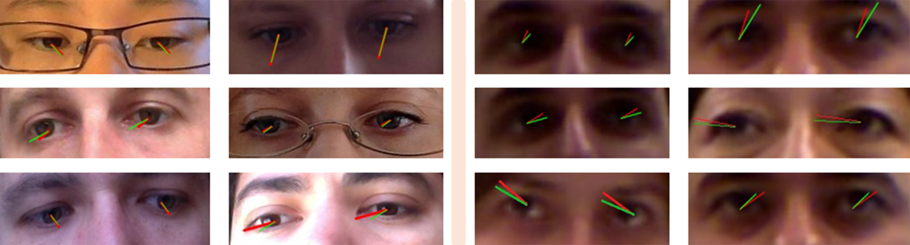

### A shallow network architecture for 3D gaze estimation
This respiratory belongs to my paper "Deep Fusion for 3D Gaze Estimation From Natural Face Images Using Multi-Stream CNNs" published in IEEE ACCESS.

### CODE Running
1) The model is in Shallow_Model.py file.
2) Data is pre-processed for both MPIIGaze and EYEDIAP datasets and pre-processing is given in seperate files for each.
3) The main file includes everything you need to train and evaluate this model. 

### Results
Some of static results on MPIIGAZE and EYEDIAP dataset is given as:

### Requirements
I used the following libraries to run this code. 

numpy = 1.18.2
pytorch = 1.1.0
openCV = 4.2.0
scipy = 1.2.0
h5py = 2.9.0
deepdish = 0.3.4

I will update this respiratory later for further clarification. 

### Citation
Please if you use this model or any details in your work, do cite my paper 

A. Ali and Y. Kim, "Deep Fusion for 3D Gaze Estimation From Natural Face Images Using Multi-Stream CNNs," in IEEE Access, vol. 8, pp. 69212-69221, 2020.
